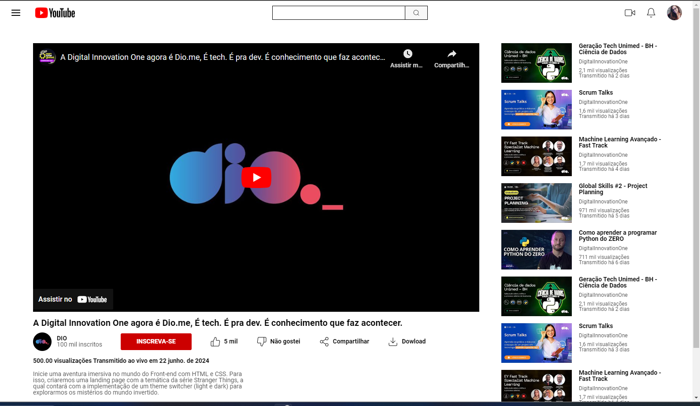

# Entrega de projeto - Clonando a Página do Youtube com CSS | DIO
Neste desafio, você terá a oportunidade de colocar em prática os conceitos aprendidos sobre Flexbox ao clonar a página inicial do YouTube. O objetivo é criar uma versão semelhante à interface do YouTube usando apenas CSS para posicionar os elementos na página.

### Tecnologias Utilizadas
- HTML
- CSS (com ênfase em Flexbox)

### Para ver a página
[Link do projeto](https://fabiocasadossites.github.io/desafio-2-css-dio/)

 

## 👨‍💻 Expert

    
    
&nbsp&nbsp&nbspFabio Augusto 
    &nbsp&nbsp&nbsp
    <a href="https://github.com/fabiocasadossites">
    GitHub</a>&nbsp;|&nbsp;
    <a href="https://www.linkedin.com/in/fabioasa/">LinkedIn</a>
&nbsp;|&nbsp;
    <a href="https://www.fabioaugusto.dev/">
    Portfolio </a>
&nbsp;&nbsp;

 

💻 com ❤️ por [Fabio Augusto](https://github.com/fabiocasadossites)

